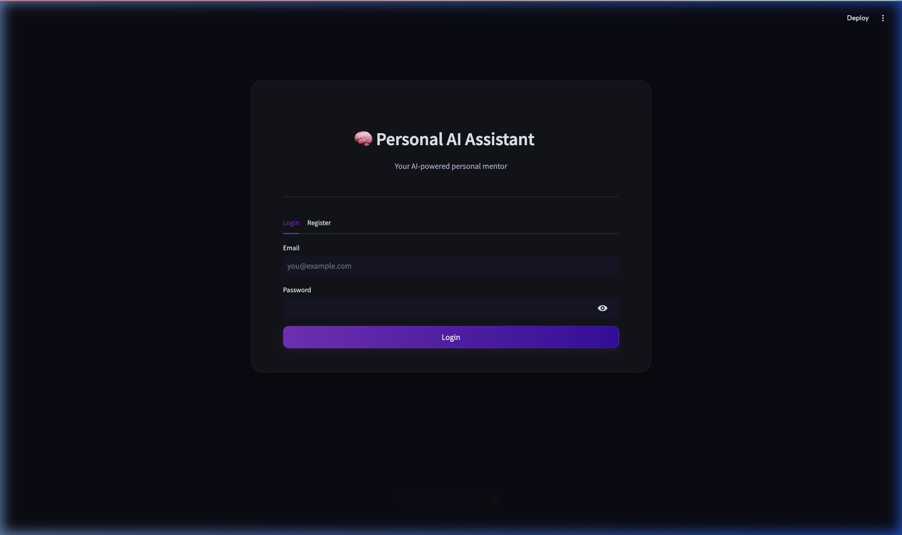
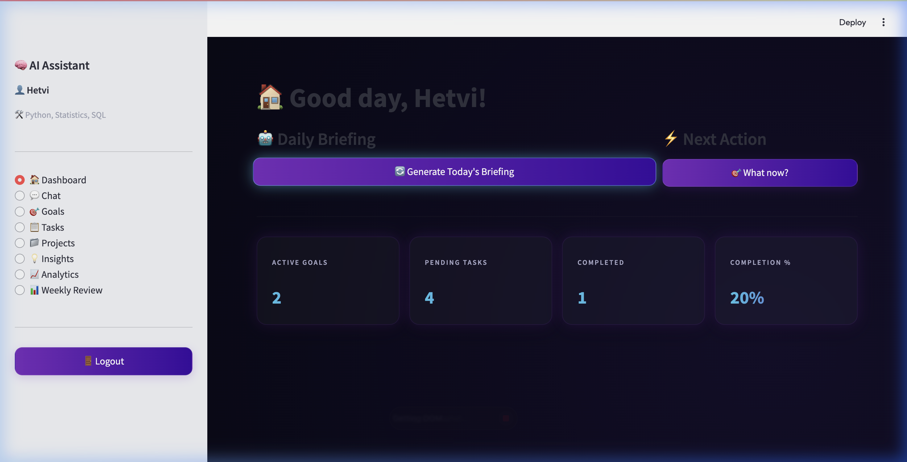
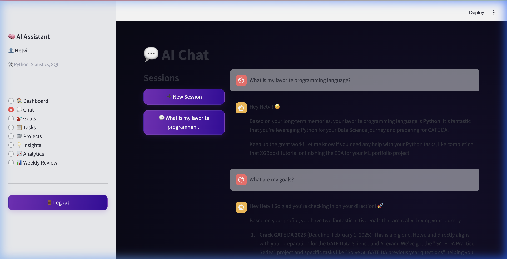
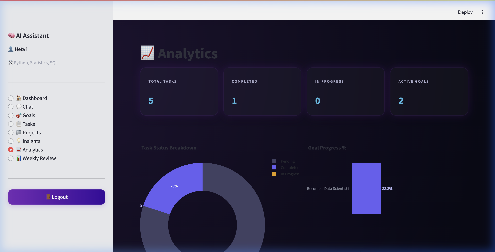
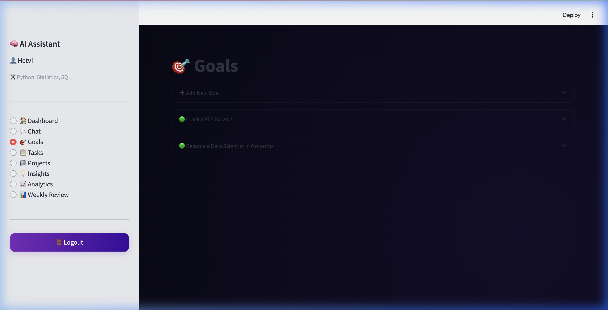
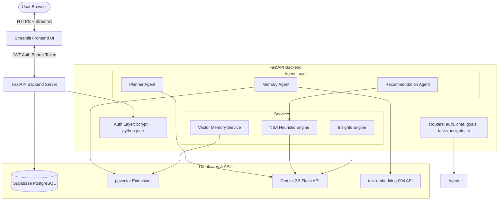

# 🧠 Saarthi AI — Personal AI Mentor & Goal Planner

> A production-grade Personal AI Assistant with long-term vector memory, dynamic task ranking, automated learning roadmaps, interactive analytics, and multi-user isolation.

[](https://github.com/Hetvi16-05/Personal-AI-Assistant)
[](LICENSE)
[](docker-compose.yml)

---

## 📸 Interface Preview

### 1. Website Login Screen (Glassmorphism Dark Theme)
A wide, centered login portal featuring native Streamlit dark mode configurations and glassmorphic card overlays.


### 2. Daily Briefing & Next Best Action
Get an overview of your active metrics, AI-generated daily study schedules, and your highest priority recommendation.


### 3. Long-Term Semantic Chat Memory
Chat with your personal AI mentor. It remembers what you tell it across sessions using pgvector cosine similarity search.


### 4. Interactive Performance Analytics (Plotly)
Visualize your goal completion progress, task status donuts, and priority distribution graphs dynamically.


### 5. Goal Roadmap Planner & Milestone Progress
Break down long-term goals (e.g. *Crack GATE DA 2025*) into milestone roadmaps generated automatically by the Gemini planner agent.


---

## 🎬 Live Walkthrough Demo

Watch the assistant in action—generating briefings, recalling facts from memory, and managing goals dynamically:


---

## 🏗️ Technical Architecture

Saarthi AI leverages an advanced multi-agent orchestrator backed by a robust database schema and semantic vector matching:



---

## 🧮 Next Best Action (NBA) Engine V2

The assistant prioritizes your task backlog dynamically. The recommendation algorithm weights task properties against your weekly work behavior to pick the single best action to take:

$$\text{Task Score} = (\text{Impact} \times 0.35) + (\text{Urgency} \times 0.25) + (\text{Alignment} \times 0.20) + (\text{Effort Match} \times 0.10) + (\text{Focus} \times 0.05) + (\text{Consistency} \times 0.05)$$

* **Effort Match:** Represents $10 - \text{Effort Score}$, prioritizing high-impact tasks that require lesser friction.
* **Focus Score:** Density of pending tasks inside the same goal categories.
* **Consistency Score:** Streak multipliers based on consecutive daily completed tasks.

---

## ⚡ Quick Start

### 1. Setup Environment
Clone the repository and spin up a virtual environment:
```bash
git clone https://github.com/Hetvi16-05/Personal-AI-Assistant
cd Personal-AI-Assistant
python -m venv venv
source venv/bin/activate
```

### 2. Install Requirements
```bash
pip install -r backend/requirements.txt
pip install -r frontend/requirements.txt
```

### 3. Add Settings
Create your local environment file:
```bash
cp backend/.env.example backend/.env
# Edit backend/.env to add your real GEMINI_API_KEY and DATABASE_URL
```

### 4. Enable pgvector & Migrate
Run the following SQL command once in the Supabase SQL editor:
```sql
CREATE EXTENSION IF NOT EXISTS vector;
```
Apply the database schemas:
```bash
cd backend
alembic upgrade head
```

### 5. Start Servers
Launch the FastAPI backend:
```bash
cd backend
uvicorn app.main:app --reload
```
Launch the Streamlit UI:
```bash
cd frontend
streamlit run app.py
```

---

## 🐳 Docker Deployment (Local)

Run both servers containerized with one command:
```bash
docker-compose up --build
```
* **API Service:** [http://localhost:8000](http://localhost:8000) (Swagger: `/docs`)
* **Frontend Web Application:** [http://localhost:8501](http://localhost:8501)

---

## 🚀 Portfolio Hosting (Production Deployment)

### 1. Backend API (Render)
This repository includes a `render.yaml` configuration to allow quick blueprints deployment:
1. Sign up on [Render](https://render.com).
2. Connect your GitHub repository.
3. Select **Blueprints** from the dashboard, click **New Blueprint Instance**, and select this repository.
4. Add the following environment variables:
   * `DATABASE_URL`: Your Supabase database connection string.
   * `GEMINI_API_KEY`: Your Gemini API key.
   * `JWT_SECRET_KEY`: A secure random key (generated via `python3 -c "import secrets; print(secrets.token_hex(32))"`).

### 2. Frontend App (Streamlit Community Cloud)
1. Visit [Streamlit Community Cloud](https://share.streamlit.io).
2. Connect your GitHub, select this repository, set the branch to `main`, and main file path to `frontend/app.py`.
3. In **Advanced settings**, set your backend target URL as an environment variable:
   ```toml
   API_URL = "https://your-render-backend-url.onrender.com"
   ```
4. Click **Deploy!**
